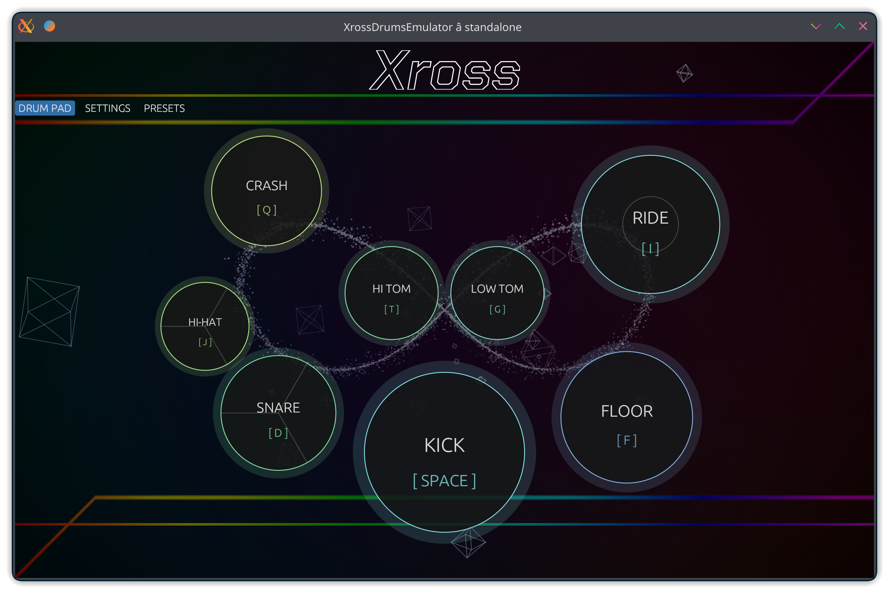

# Xross Drums Emulator


**Xross Drums Emulator** is a high-performance, next-generation drum synthesis engine built with Rust. Leveraging the modern `truce` framework, it delivers low-latency, high-fidelity percussion synthesis across multiple plugin formats and as a standalone application.



## 🛠 Features

*   **Multi-Format Support:** Seamlessly integrates into any workflow with support for **CLAP**, **VST3**, **LV2**, and **Standalone** modes.
*   **Deep Synthesis Engine:** 
    *   Individual control over **Kick, Snare, Hi-Hat, Cymbals, and Toms**.
    *   Dedicated modules for **Electric Synth**, **Transient Shaping**, **Saturation (Soft/Hard/Tape/Tube)**, and **Compression**.
*   **Precision EQ:** A visual 4-band equalizer for surgical frequency control of every drum part.
*   **Modern UI:** A sleek, responsive interface powered by `egui`, designed for high-DPI displays and efficient workflow.
*   **Factory Presets:** Includes curated presets for **Rock, Jazz, and Metal** to get you started instantly.

## 📸 Interface Gallery

### Drum Pad View
The primary performance interface with visual feedback and keybinding indicators.
image_864aaf.jpg

### Advanced Sound Design
Access deep synthesis parameters including oscillator frequency, noise decay, and saturation modes.
image_864a6e.jpg
image_864a8e.jpg

### Preset Management
Quickly swap between genre-specific kits with the built-in factory preset browser.
image_8647ab.jpg

## 🚀 Getting Started

### Prerequisites
*   **Rust Compiler:** Edition 2024 is required.
*   **Cargo-Truce:** Recommended for managing plugin builds and installation.

### Building from Source

To build and run the standalone version:
```bash
cargo run --release
```

To install all supported plugin formats (CLAP, VST3):
```bash
cargo truce install
```

## 📝 License

MIT
